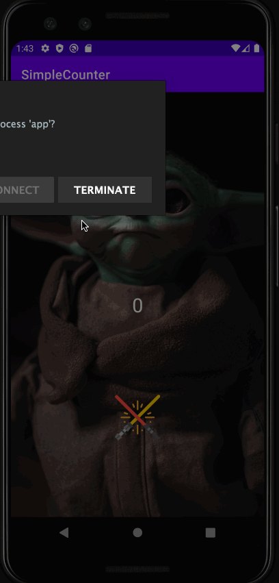

# Android Lab 1 - SimpleCounter

Submitted by: Mohamed Rachid

SimpleCounter is an android app that shows a background image and a button to be clicked, and when the button is clicked the user accumulates a score. 

Time spent: 2 hours spent in total

## Required Features

The following **required** functionality is completed:

* [X] Score displayed on screen
* [X] Button displayed on screen

The following **optional** features are implemented:

* [X] Customized background image
* [X] Customized button icon
* [X] Added an upgrade button at 100 points to increase score increments by 2 instead of 1.

## Video Walkthrough

Here's a walkthrough of implemented features:

GIF created with LICEcap

## Notes

I had trouble figuring out that I had to set the background tint of the button to null in order to display the custom icon.

## License

    Copyright 2022 Mohamed Rachid

    Licensed under the Apache License, Version 2.0 (the "License");
    you may not use this file except in compliance with the License.
    You may obtain a copy of the License at

        http://www.apache.org/licenses/LICENSE-2.0

    Unless required by applicable law or agreed to in writing, software
    distributed under the License is distributed on an "AS IS" BASIS,
    WITHOUT WARRANTIES OR CONDITIONS OF ANY KIND, either express or implied.
    See the License for the specific language governing permissions and
    limitations under the License.
